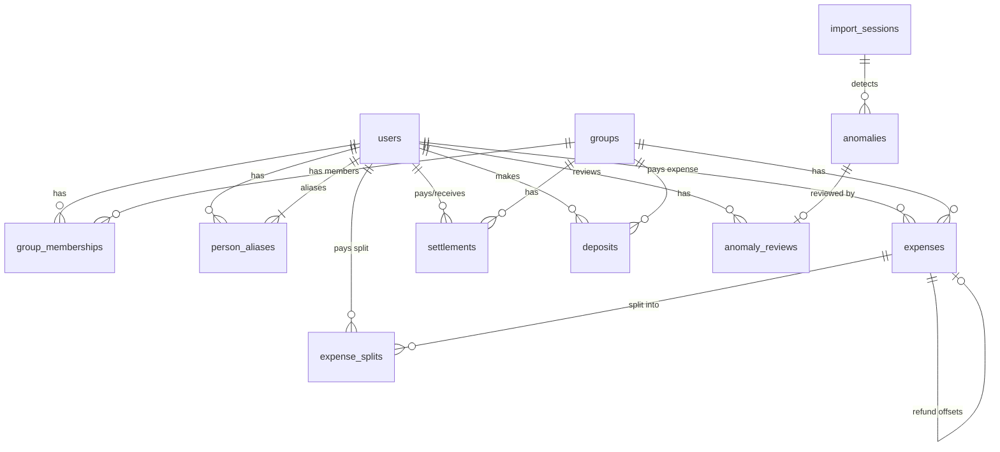

# Scope and Design Documentation

## Database Schema

The database consists of 11 tables designed to track users, groups, memberships, expenses, splits, settlements, deposits, import sessions, anomalies, and reviews.

### Table Definitions

#### 1. `users`
Tracks individual participants.
- `id` (INTEGER, Primary Key): Unique identifier.
- `name` (VARCHAR, Unique, Indexed): User's display name or canonical name.
- `email` (VARCHAR, Nullable, Indexed): Email address (null for guests).
- `password_hash` (VARCHAR, Nullable): Hashed password (null for guests).
- `is_guest` (BOOLEAN, Default False): Flag for users created on-the-fly during import who cannot log in.
- `created_at` (DATETIME): Timestamp when created.

#### 2. `groups`
Shared expense pools.
- `id` (INTEGER, Primary Key): Unique identifier.
- `name` (VARCHAR): Group name.
- `created_at` (DATETIME): Timestamp when created.

#### 3. `group_memberships`
Tracks historical membership within groups.
- `id` (INTEGER, Primary Key): Unique identifier.
- `group_id` (INTEGER, Foreign Key -> `groups.id`): Associated group.
- `user_id` (INTEGER, Foreign Key -> `users.id`): Associated user.
- `joined_at` (DATE): Date user joined.
- `left_at` (DATE, Nullable): Date user left (null if active).

#### 4. `expenses`
Records individual expenses.
- `id` (INTEGER, Primary Key): Unique identifier.
- `group_id` (INTEGER, Foreign Key -> `groups.id`): Associated group.
- `title` (VARCHAR): Expense description/title.
- `description` (VARCHAR, Nullable): Additional notes.
- `amount` (FLOAT): Original amount paid.
- `currency` (VARCHAR): Original currency (e.g., USD, INR).
- `exchange_rate` (FLOAT): Fixed conversion rate to base currency (INR).
- `normalized_amount` (FLOAT): Amount converted to INR.
- `paid_by` (INTEGER, Foreign Key -> `users.id`): Person who paid.
- `expense_date` (DATE): Transaction date.
- `is_refund` (BOOLEAN, Default False): True if transaction represents a refund.
- `refund_of_expense_id` (INTEGER, Foreign Key -> `expenses.id`, Nullable): Reference to the original expense this refund offsets.
- `created_at` (DATETIME): Timestamp when created.

#### 5. `expense_splits`
Individual shares of an expense.
- `id` (INTEGER, Primary Key): Unique identifier.
- `expense_id` (INTEGER, Foreign Key -> `expenses.id`): Associated expense.
- `user_id` (INTEGER, Foreign Key -> `users.id`): Person responsible for this share.
- `split_type` (VARCHAR): Type of split (`equal`, `percentage`, `unequal`, `share`).
- `split_amount` (FLOAT): Amount owed by this user in normalized terms (INR).
- `split_percentage` (FLOAT, Nullable): User's share percentage.

#### 6. `settlements`
Direct payments between users to resolve balances.
- `id` (INTEGER, Primary Key): Unique identifier.
- `payer_id` (INTEGER, Foreign Key -> `users.id`): User making the payment.
- `receiver_id` (INTEGER, Foreign Key -> `users.id`): User receiving the payment.
- `amount` (FLOAT): Settlement amount in INR.
- `settlement_date` (DATE): Date of transaction.
- `group_id` (INTEGER, Foreign Key -> `groups.id`): Group scope of settlement.
- `created_at` (DATETIME): Timestamp when created.

#### 7. `deposits`
Payments made by a user into the group's shared pool.
- `id` (INTEGER, Primary Key): Unique identifier.
- `user_id` (INTEGER, Foreign Key -> `users.id`): User making deposit.
- `amount` (FLOAT): Deposit amount in INR.
- `deposit_date` (DATE): Date of transaction.
- `group_id` (INTEGER, Foreign Key -> `groups.id`): Group scope of deposit.
- `created_at` (DATETIME): Timestamp when created.

#### 8. `import_sessions`
Audit trail for CSV imports.
- `id` (INTEGER, Primary Key): Unique identifier.
- `filename` (VARCHAR): Name of imported CSV.
- `status` (VARCHAR): Session status (`processing`, `completed`, `failed`).
- `created_at` (DATETIME): Timestamp when created.

#### 9. `anomalies`
Records anomalies flagged during import.
- `id` (INTEGER, Primary Key): Unique identifier.
- `import_session_id` (INTEGER, Foreign Key -> `import_sessions.id`): Associated import session.
- `row_number` (INTEGER): Row number in CSV.
- `anomaly_type` (VARCHAR): Type of anomaly (e.g. `DuplicateRule`, `ZeroAmountRule`).
- `severity` (VARCHAR): Severity level (`low`, `medium`, `high`).
- `detected_value` (VARCHAR, Nullable): The raw data that triggered anomaly.
- `action_taken` (VARCHAR): Automated resolution performed.
- `requires_approval` (BOOLEAN): True if approval is required.
- `created_at` (DATETIME): Timestamp when created.

#### 10. `anomaly_reviews`
Decisions made on anomalies.
- `id` (INTEGER, Primary Key): Unique identifier.
- `anomaly_id` (INTEGER, Foreign Key -> `anomalies.id`): Associated anomaly.
- `decision` (VARCHAR): Decision made (`approve`, `reject`).
- `reviewed_by` (INTEGER, Foreign Key -> `users.id`): Reviewer user.
- `reviewed_at` (DATETIME): Timestamp when reviewed.

#### 11. `person_aliases`
Handles names spelling variations.
- `id` (INTEGER, Primary Key): Unique identifier.
- `canonical_user_id` (INTEGER, Foreign Key -> `users.id`): Canonical user reference.
- `alias_name` (VARCHAR, Unique, Indexed): Alternative spelling or name variation.

## Anomaly Detection Engine

The import pipeline runs a series of 13 validation rules in a specific order to catch and resolve anomalies.

| Anomaly Type | Detecting Rule | Severity | Resolution Policy | Requires Review |
|---|---|---|---|---|
| Non-Member Participant | `ParticipantRule` | Low/Medium | Create guest user with `is_guest = True` if not found; flag user who has no group membership. | Yes |
| Name Variation | `NameNormalizationRule` | Low | Trim whitespace and check `person_aliases`. Normalize to canonical name in database. | No |
| Format Ambiguity / Unusual Date | `DateRule` | Medium | Parse to date. If format is ambiguous (e.g. `Mar-14` or `04-05-2026`), flag. | Yes |
| Membership Violation | `MembershipRule` | High | Check if transaction date is within membership dates. Exclude inactive member from splits. | Yes |
| Currency Conversion | `CurrencyRule` | Medium/Low | Apply fixed conversion rate (1 USD = 83 INR). If currency field is blank, default to INR and flag. | Yes (if empty) |
| Settlement as Expense | `SettlementRule` | Medium | Match regex `X paid Y back`. If matched, create Settlement record instead of Expense, and **STOP** validation. | Yes |
| Deposit as Expense | `DepositRule` | Low | Match description containing 'deposit'. If matched, create Deposit record, and **STOP** validation. | No |
| Refund | `RefundRule` | Medium | Match description containing 'refund' and amount < 0. Set `is_refund = True`, look up prior expense by title overlap >= 0.5 to link. | Yes |
| Negative Amount | `NegativeAmountRule` | Medium | Match amount < 0 without 'refund' keyword. Import as-is and **STOP** validation. | Yes |
| Zero Amount | `ZeroAmountRule` | Medium | Flag transactions with amount == 0. Import as-is. | Yes |
| Split Correctness | `SplitRule` | Medium/High | Validate splits (e.g. percentages sum to 100%, unequal sum to total, or ignore details if type is 'equal'). | Yes |
| Duplicate Expense | `DuplicateRule` | High | Check for exact duplicate expenses (same group, date, payer, amount, title overlap >= 0.8). Flag second. | Yes |
| Near Duplicate | `NearDuplicateRule` | High | Check for fuzzy duplicate (different amounts). Flag both. | Yes |
| Missing Payer | (Validation Layer) | High | If payer field is empty, reject and skip row entirely. | Yes |

## Net Balances and Optimization Reconciliation

The sum of all net balances in "The Flat" group is exactly **+14,636.00 INR**. This net surplus has two causes:
1. **Sam's Deposit (+15,000.00 INR):** Converted to a deposit on Row 38. A deposit represents cash paid into the group's shared pool. It increases Sam's net balance directly without a matching user debt decrease (as it resides in the shared pool).
2. **110% Split Mismatches (-364.00 INR):** Two percentage split rows sum to 110% instead of 100%. Row 15 Pizza Friday (1,440.00 INR total, 10% mismatch = `-144.00 INR`) and Row 32 Weekend brunch (2,200.00 INR total, 10% mismatch = `-220.00 INR`). This results in +364 INR more owed in splits than the actual expenses paid, creating a `-364.00 INR` total reduction.

Reconciliation: `+15,000.00 INR (deposit) - 364.00 INR (mismatches) = +14,636.00 INR`.

Because the net balance sum is non-zero, the settlement optimizer cannot fully zero out all user balances (there will be a net surplus of +14,636.00 INR reflecting the cash pool asset and the percentage split mismatch).
