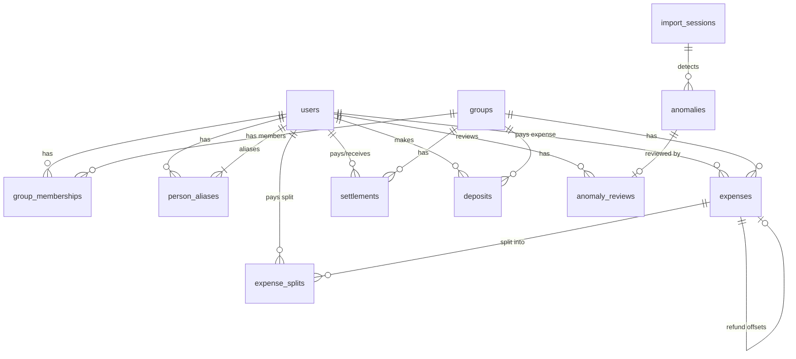

# Scope and Design Documentation

## Database Schema

The database consists of 11 tables designed to track users, groups, memberships, expenses, splits, settlements, deposits, import sessions, anomalies, and reviews.

### Table Definitions

#### 1. `users`
Tracks individual participants.
- `id` (INTEGER, Primary Key): Unique identifier.
- `name` (VARCHAR, Unique, Indexed): User's display name or canonical name.
- `email` (VARCHAR, Nullable, Indexed): Email address (null for guests).
- `password_hash` (VARCHAR, Nullable): Hashed password (null for guests).
- `is_guest` (BOOLEAN, Default False): Flag for users created on-the-fly during import who cannot log in.
- `created_at` (DATETIME): Timestamp when created.

#### 2. `groups`
Shared expense pools.
- `id` (INTEGER, Primary Key): Unique identifier.
- `name` (VARCHAR): Group name.
- `created_at` (DATETIME): Timestamp when created.

#### 3. `group_memberships`
Tracks historical membership within groups.
- `id` (INTEGER, Primary Key): Unique identifier.
- `group_id` (INTEGER, Foreign Key -> `groups.id`): Associated group.
- `user_id` (INTEGER, Foreign Key -> `users.id`): Associated user.
- `joined_at` (DATE): Date user joined.
- `left_at` (DATE, Nullable): Date user left (null if active).

#### 4. `expenses`
Records individual expenses.
- `id` (INTEGER, Primary Key): Unique identifier.
- `group_id` (INTEGER, Foreign Key -> `groups.id`): Associated group.
- `title` (VARCHAR): Expense description/title.
- `description` (VARCHAR, Nullable): Additional notes.
- `amount` (FLOAT): Original amount paid.
- `currency` (VARCHAR): Original currency (e.g., USD, INR).
- `exchange_rate` (FLOAT): Fixed conversion rate to base currency (INR).
- `normalized_amount` (FLOAT): Amount converted to INR.
- `paid_by` (INTEGER, Foreign Key -> `users.id`): Person who paid.
- `expense_date` (DATE): Transaction date.
- `is_refund` (BOOLEAN, Default False): True if transaction represents a refund.
- `refund_of_expense_id` (INTEGER, Foreign Key -> `expenses.id`, Nullable): Reference to the original expense this refund offsets.
- `created_at` (DATETIME): Timestamp when created.

#### 5. `expense_splits`
Individual shares of an expense.
- `id` (INTEGER, Primary Key): Unique identifier.
- `expense_id` (INTEGER, Foreign Key -> `expenses.id`): Associated expense.
- `user_id` (INTEGER, Foreign Key -> `users.id`): Person responsible for this share.
- `split_type` (VARCHAR): Type of split (`equal`, `percentage`, `unequal`, `share`).
- `split_amount` (FLOAT): Amount owed by this user in normalized terms (INR).
- `split_percentage` (FLOAT, Nullable): User's share percentage.

#### 6. `settlements`
Direct payments between users to resolve balances.
- `id` (INTEGER, Primary Key): Unique identifier.
- `payer_id` (INTEGER, Foreign Key -> `users.id`): User making the payment.
- `receiver_id` (INTEGER, Foreign Key -> `users.id`): User receiving the payment.
- `amount` (FLOAT): Settlement amount in INR.
- `settlement_date` (DATE): Date of transaction.
- `group_id` (INTEGER, Foreign Key -> `groups.id`): Group scope of settlement.
- `created_at` (DATETIME): Timestamp when created.

#### 7. `deposits`
Payments made by a user into the group's shared pool.
- `id` (INTEGER, Primary Key): Unique identifier.
- `user_id` (INTEGER, Foreign Key -> `users.id`): User making deposit.
- `amount` (FLOAT): Deposit amount in INR.
- `deposit_date` (DATE): Date of transaction.
- `group_id` (INTEGER, Foreign Key -> `groups.id`): Group scope of deposit.
- `created_at` (DATETIME): Timestamp when created.

#### 8. `import_sessions`
Audit trail for CSV imports.
- `id` (INTEGER, Primary Key): Unique identifier.
- `filename` (VARCHAR): Name of imported CSV.
- `status` (VARCHAR): Session status (`processing`, `completed`, `failed`).
- `created_at` (DATETIME): Timestamp when created.

#### 9. `anomalies`
Records anomalies flagged during import.
- `id` (INTEGER, Primary Key): Unique identifier.
- `import_session_id` (INTEGER, Foreign Key -> `import_sessions.id`): Associated import session.
- `row_number` (INTEGER): Row number in CSV.
- `anomaly_type` (VARCHAR): Type of anomaly (e.g. `DuplicateRule`, `ZeroAmountRule`).
- `severity` (VARCHAR): Severity level (`low`, `medium`, `high`).
- `detected_value` (VARCHAR, Nullable): The raw data that triggered anomaly.
- `action_taken` (VARCHAR): Automated resolution performed.
- `requires_approval` (BOOLEAN): True if approval is required.
- `created_at` (DATETIME): Timestamp when created.

#### 10. `anomaly_reviews`
Decisions made on anomalies.
- `id` (INTEGER, Primary Key): Unique identifier.
- `anomaly_id` (INTEGER, Foreign Key -> `anomalies.id`): Associated anomaly.
- `decision` (VARCHAR): Decision made (`approve`, `reject`).
- `reviewed_by` (INTEGER, Foreign Key -> `users.id`): Reviewer user.
- `reviewed_at` (DATETIME): Timestamp when reviewed.

#### 11. `person_aliases`
Handles names spelling variations.
- `id` (INTEGER, Primary Key): Unique identifier.
- `canonical_user_id` (INTEGER, Foreign Key -> `users.id`): Canonical user reference.
- `alias_name` (VARCHAR, Unique, Indexed): Alternative spelling or name variation.
